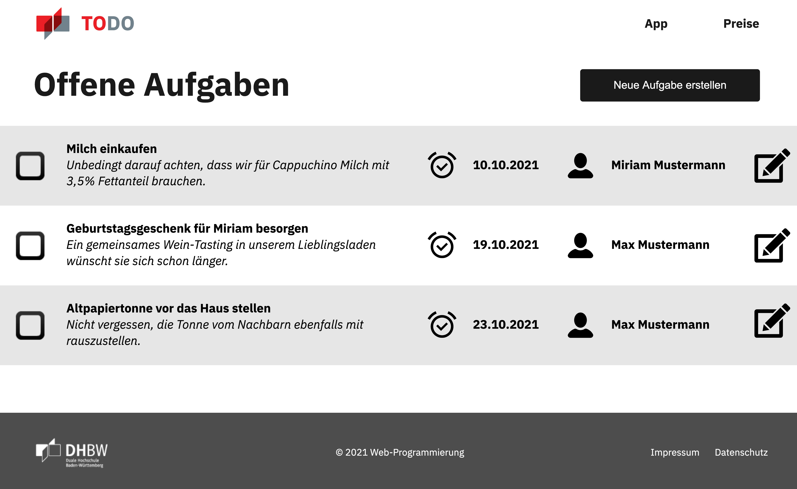
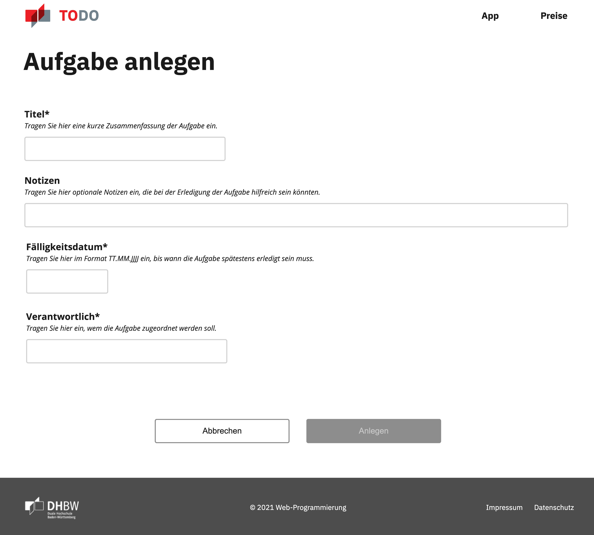
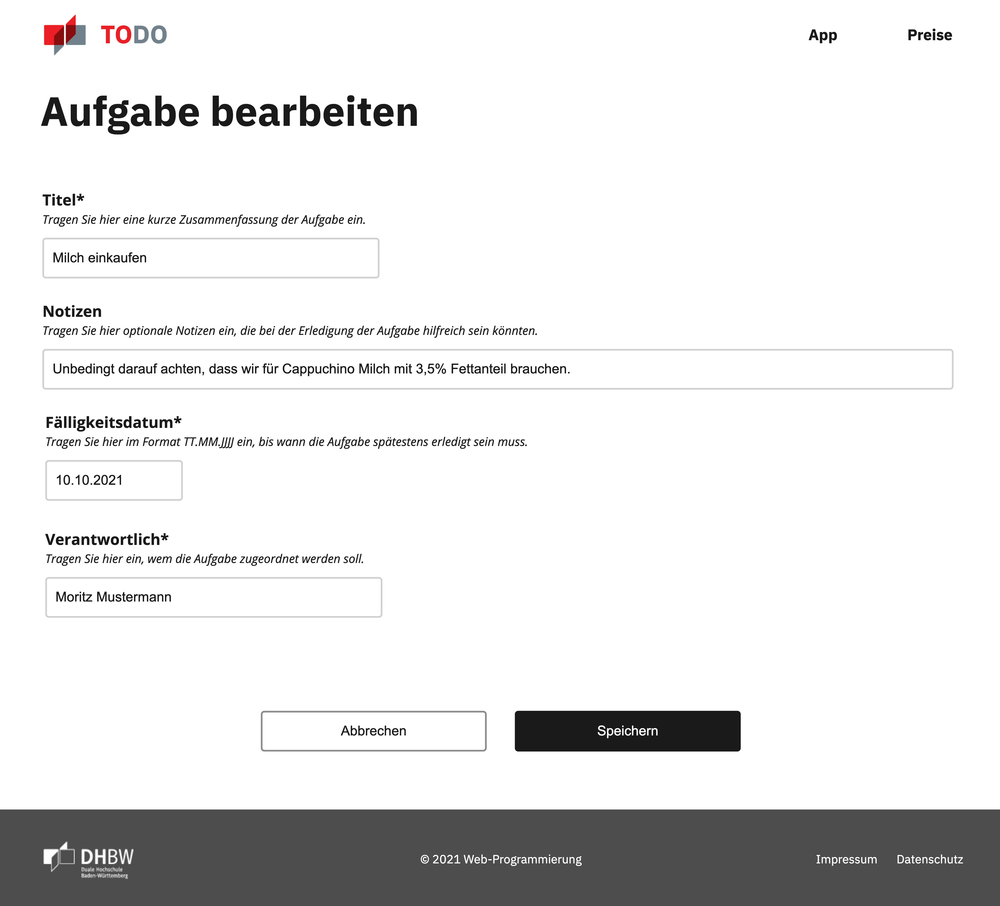
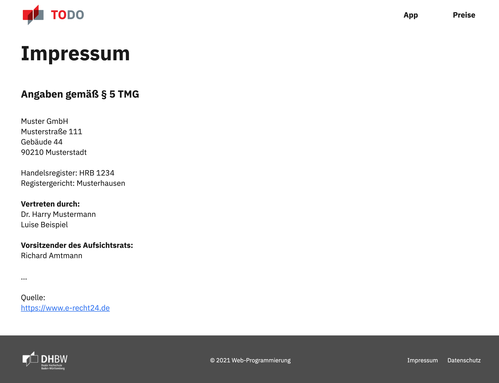
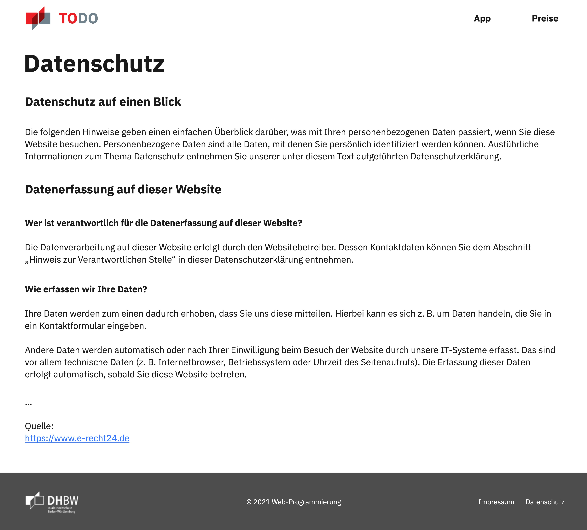

== Allgemeine Hinweise zu den Übungen

=== Kontext

Die Anwendung "TODO" ist ein webbasierte Aufgabenplaner, der im Zuge der Vorlesung nach und nach entwickelt wird.

Strukturell besteht die Anwendung aus verschiedenen Seiten bzw. Ansichten:

- Die *Startseite* zeigt Marketing-Informationen zum Produkt. Ziel ist, Besucher der Seite von der Anwendung zu überzeugen und sie so zu Benutzern zu machen.
- Im Bereich *Preise* werden die verschiedenen Preismodelle mit den jeweils enthaltenen Funktionen dargestellt. Ziel ist, Besuchern und Benutzern die Wahl des für sie passenden Preismodells zu vereinfachen.
- Die App führt zur *Aufgabenliste* und bietet außerdem Möglichkeiten zur *Aufgabenanlage* und *Aufgabenbearbeitung*. Ziel ist, Benutzern eine intuitive Möglichkeit zur Anlage und Verwaltung von Aufgabeneinträgen zu bieten.
- Im *Impressum* sind rechtlich verpflichtende Angaben zum Anbieter der Anwendung hinterlegt.
- Unter *Datenschutz* sind rechtlich verpflichtende Angaben zum Umgang mit Benutzerdaten verfügbar.

Entwürfe aller Seiten sind nachfolgend aufgeführt.

<<<

==== Startseite

==== Preise

==== Aufgabenliste

==== Aufgabenanlage

<<<

==== Aufgabenbearbeitung

==== Impressum

<<<

==== Datenschutz

=== Werkzeuge

Als Teil der Aufgabenstellung finden Sie verschiedene aufgabenspezifische URLs, auf die in der nachfolgenden Anleitung verwiesen wird.

* `<initial-github>`: Verweist auf den initialen Quellcode in GitHub.
* `<initial-download>`: Verweist auf den Download des initialen Quellcodes in Form eines Zip-Archivs
* `<initial-ide`: Verweist auf die Online-Entwicklungsumgebung, in der bereits der initiale Quellcode geladen ist.

Die Bearbeitung aller Aufgaben kann lokal auf Ihrem Rechner erfolgen, ist aber nicht empfohlen. Sie benötigen hierfür:

* Einen Web-Browser wie z.B. Firefox (https://www.mozilla.org/de/firefox/new/).
* Einen Text-Editor wie z.B. das kostenlose Visual Studio Code (https://code.visualstudio.com/).

In diesem Fall richten Sie das Projekt folgendermaßen ein:

* Laden Sie den Inhalt von `<initial-download` herunter. Ersetzen Sie vor Aufruf der URL den enthaltenen Platzhalter.
* Entpacken Sie das Zip-Archiv.
* Zum Bearbeiten der Dateien öffnen Sie diese im Text-Editor.
* Zum Anzeigen des Dokuments öffnen Sie dieses im Browser.

Empfohlen wird die Nutzung des kostenlosen Online-Tools https://stackblitz.com, welches die komplette Entwicklungsumgebung im Web-Browser bereitstellt und keine Registrierung erfordert.
In diesem Fall reicht ein Web-Browser auf Ihrem Rechner aus.

* Öffnen Sie die URL `<initial-ide>` im Browser.
* Nach einer Änderung müssen Sie das Dokument speichern und die Vorschau im rechten Teil des Fensters aktualisieren.
* Sie können außerdem die rechts dargestellte URL verwenden und die Seite direkt im Browser aufrufen.
* Die Dateien aus dem Editor können Sie sich über die Export-Funktion (das Wolken-Icon im Screenshot) als Zip-Archiv herunterladen.

Empfohlen wird die Nutzung des kostenlosen Online-Tools https://stackblitz.com, welches die komplette Entwicklungsumgebung im Web-Browser bereitstellt und keine Registrierung erfordert.
In diesem Fall reicht ein Web-Browser auf Ihrem Rechner aus.

* Öffnen Sie die URL `<initial-ide>` im Browser.
* Nach einer Änderung müssen Sie das Dokument speichern und die Vorschau im rechten Teil des Fensters aktualisieren.
* Sie können außerdem die rechts dargestellte URL verwenden und die Seite direkt im Browser aufrufen.
* Die Dateien aus dem Editor können Sie sich über die Export-Funktion (das Wolken-Icon im Screenshot) als Zip-Archiv herunterladen.
