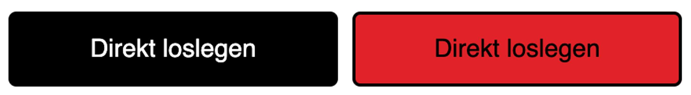

== Übungsaufgabe zu Modul 1d (CSS: App)

In dieser Übungsaufgabe werden die bestehenden HTML-Dokumente verwendet.
Durch Erweiterungen in der CSS-Datei wird die Darstellung so angepasst, dass sie den Wireframes weitestgehend entsprecht.
An dieser Stelle geht es ausschließlich um das Layout und die visuelle Gestaltung.

Dynamisches Verhalten spielt an dieser Stelle noch keine Rolle.
Das wird Gegenstand der nächsten Übungsaufgaben sein.

Für diese Aufgabe werden alle CSS-Anweisungen in der Datei styles.css hinterlegt.
Es kann notwendig sein, dass Sie die HTML-Struktur leicht modifizieren müssen, indem Sie z.B. weitere div-Tags einfügen.
Die Startseite `index.html` ist bereits so überarbeitet, dass sie Ähnlichkeit mit den Wireframes aufweist.

Wenn Sie wie empfohlen mit Stackblitz arbeiten und die Entwicklungsumgebung über den Link aus `<initial-ide>` öffnen, ist alles voreingestellt.

=== Platzhalter

Nachfolgend sind die spezifischen Parameter, die in der grundlegenden Einführung zu den Übungen erwähnt sind.

|===
|Platzhalter |Wert

|`<initial-github>`
|https://github.com/baitando/dhbw-web/tree/main/01d_css/app/initial

|`<initial-download>`
|https://baitando.github.io/down-git/#/home?url=https://github.com/baitando/dhbw-web/tree/main/01d_css/app/initial

|`<initial-ide>`
|https://stackblitz.com/fork/github/baitando/dhbw-web/tree/main/01d_css/app/initial?file=style.css&terminal=stackblitz&title=%C3%9Cbungsaufgabe%20zu%20Modul%201d%20%28CSS%3A%20App%29&initialpath=index.html
|===

=== Aufgabenbeschreibung

. Erstellen Sie CSS-Anweisungen, die dafür sorgen, dass Buttons (z.B. „Direkt loslegen“ auf der Startseite index.html) die Hintergrundfarbe #e22329 annehmen und die Beschriftung in schwarzer Farbe zeigen, wenn sich der Mauszeiger auf dem Button befindet (links ist der normale Button dargestellt, rechts der Button, auf dem sich der Mauszeiger befindet).
+

. Wechseln Sie auf die Seite mit der Aufgabenliste (liste.html).
    .. Ordnen Sie die Überschrift erster Ordnung und den Button „Neue Aufgabe anlegen“ nebeneinander an.
    .. Formatieren Sie die Überschrift erster Ordnung. Stellen Sie sicher, dass sich der Button genauso verhält wie auf der Startseite.
    .. Definieren Sie, dass die Icons innerhalb der Aufgabeneinträge mit einer Breite von 30px angezeigt werden und die Höhe des Icons linear mitskaliert wird.
    .. Erzeugen Sie ein passendes Layout für die Aufgaben, die in der unsortierten Liste enthalten sind. Stellen Sie sicher, dass die Elemente einer Aufgabe entsprechend den Wireframes angeordnet sind.
    .. Stellen Sie sicher, dass die Bestandteile einer Aufgabe in jeder Zeile gleich breit sind, d.h. dass z.B. das Fälligkeitsdatum in jeder Zeile bündig zur vorherigen beginnt.
    .. Formatieren Sie die Bestandteile einer Aufgabe wie in den Wireframes gezeigt teilweise kursiv und teilweise fett. Beachten Sie auch die Abstände innerhalb eines Listeneintrages, die ungefähr eingehalten werden sollten.
    .. Färben Sie jede zweite Zeile mit der Hintergrundfarbe lightgray ein. Beginnen Sie mit dem Einfärben in der ersten Zeile wie in den Wireframes dargestellt.
. Wechseln Sie auf die Seite für die Aufgabenanlage (anlage.html).
    .. Stellen Sie sicher, dass sich die Überschrift erster Ordnung an der gleichen Stelle befindet, an der Sie sich auf der Seite mit der Aufgabenliste befindet (gleicher Abstand zum Logo oben).
    .. Gruppieren Sie jeweils das Label, den Erklärungstext und das Eingabefeld in einem eigenen div. Gruppieren Sie auch die beiden Buttons in einem div.
    .. Stellen Sie sicher, dass sich der Button „Anlegen“ so verhält wie z.B. der Button auf der Startseite.
    .. Stellen Sie sicher, dass der Button „Abbrechen“ im Normalzustand einen weißen Hintergrund mit schwarzer Schrift verwendet. Die Darstellung im Zustand des Mauszeigers über dem Button soll genau wie bei den bisherigen Buttons erfolgen.
    .. Richten Sie die beiden Buttons horizontal mittig aus.
    .. Formatieren Sie die Bestandteile des Formulars wie in den Wireframes gezeigt teilweise kursiv und teilweise fett. Beachten Sie auch die Abstände zwischen den Formularelementen und den Gruppen im Formular.

Sobald Sie mit den oben aufgeführten Aufgaben fertig sind, können Sie die folgenden Schritte zusätzlich umsetzen:

.	Formatieren Sie die Seite mit den Preisen (preise.html) entsprechend den Wireframes.
.	Formatieren Sie das Impressum (impressum.html) entsprechend den Wireframes.
.	Formatieren Sie die Datenschutz-Seite (datenschutz.html) entsprechend den Wireframes.

=== Tipps

- *Zu 1.:* Nutzen Sie die Pseudoklasse hover um das Aussehen bei Berührung mit dem Mauszeiger zu modifizieren.
- *Zu 2. b):* Gruppieren Sie die beiden Elemente in einem div-Element. Nutzen Sie ein Flex-Layout für die Positionierung innerhalb des div-Elements. Die vertikal zentrierte Ausrichtung erreichen Sie durch Verwendung des Wertes auto für margin-top und margin-bottom für die zu zentrierenden Elemente. Achten Sie auch darauf, den Bereich des Buttons den verbleibenden Platz einnehmen zu lassen und richten Sie den Button rechts aus.
- *Zu 2. c):* Wählen Sie einen passenden Selektor und definieren Sie die Breite auf 30px und die Höhe auf 100% für die lineare Skalierung der Höhe.
- *Zu 2. e):* Verwenden Sie z.B. in Prozent angegebene Breiten für die einzelnen Bestandteile einer Aufgabe.
- *Zu 2. f):* Gruppieren Sie die Teile, die nebeneinander erscheinen sollen, in div-Elementen. Wählen Sie ein Flex-Layout für die Anordnung nebeneinander. Die vertikal zentrierte Ausrichtung erreichen Sie auch hier durch die Verwendung des Wertes auto für margin-top und margin-bottom.
- *Zu 2. g):* Für die Einfärbung jeder zweiten Zeile können Sie die Pseudoklasse nth-child(odd) verwenden.

=== Lösungsbeispiel

Eine beispielhafte Lösung finden Sie auf GitHub unter https://github.com/baitando/dhbw-web/tree/main/01d_css/basics/result.

Sie können dieses Lösungsbeispiel durch Öffnen der URL https://stackblitz.com/fork/github/baitando/dhbw-web/tree/main/01d_css/basics/result?file=style.css&terminal=stackblitz&title=L%C3%B6sungsbeispiel%20zu%20%C3%9Cbungsaufgabe%20zu%20Modul%201d%20%28CSS%3A%20Grundlagen%29&initialpath=index.html im Browser direkt in der Online-Entwicklungsumgebung betrachten.
