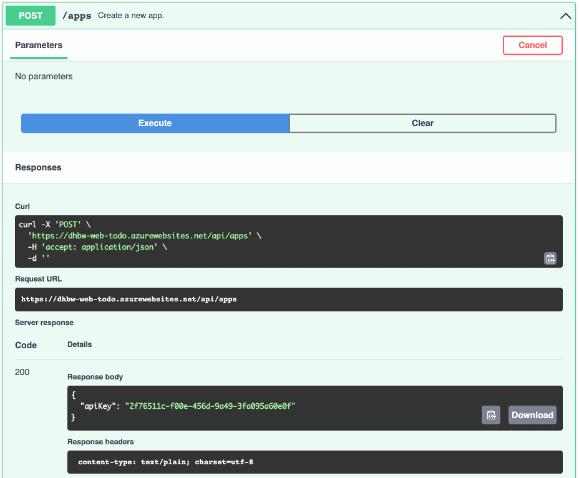

== Übungsaufgabe zu Modul 2b (APIs: Dokumentation)

In dieser Übungsaufgabe geht es um die Spezifikation von REST APIs im OpenAPI-Format sowie die Nutzung der Werkzeuge Swagger Editor und Swagger UI.

=== Platzhalter

Nachfolgend sind die spezifischen Parameter, die in der grundlegenden Einführung zu den Übungen erwähnt sind.

|===
|Platzhalter |Wert

|`<initial-github>`
|https://github.com/baitando/dhbw-web/tree/main/02b_apis/docs/initial

|`<initial-download>`
|https://baitando.github.io/down-git/#/home?url=https://github.com/baitando/dhbw-web/tree/main/02b_apis/docs/initial

|`<initial-ide`
|https://editor.swagger.io/?url=https://raw.githubusercontent.com/baitando/dhbw-web/master/02b_apis/docs/initial/todo.yaml
|===

=== Aufgabenbeschreibung

. Öffnen Sie die vorhandene Spezifikation mit dem Swagger-Editor und legen Sie eine neue App an.
    .. b.	Machen Sie sich mit der bestehenden Spezifikation vertraut, indem Sie sich die Inhalte auf der linken Seite und deren Visualisierung auf der rechten Seite ansehen.
    .. c.	Legen Sie eine neue App an, indem Sie in der Swagger UI zum entsprechenden Eintrag navigieren, dort auf „Try it out“ und anschließend „Execute“ klicken. Kopieren
+
Sie sich den apiKey aus der Antwort.
+

    .. Gehen Sie ähnlich vor, um mithilfe der Swagger UI zwei Aufgaben über die API anzulegen. Tragen Sie als Wert für das Eingabefeld „x-api-key“ den apiKey ein, den Sie vorhin kopiert hatten. In der großen Eingabebox können Sie die JSON-Eingabedaten für den Request modifizieren.
    .. Fragen Sie nun analog die Liste aller Einträge über die Swagger UI ab. Prüfen Sie, ob die Liste die von Ihnen angelegten Einträge enthält.
. Erweitern Sie die API-Spezifikation nun um die Möglichkeit, alle Aufgaben zu löschen. Die API am Server sieht das bereits vor. Hier geht es darum, dass Sie die Spezifikation entsprechend ändern. Die Änderungen sind dann richtig, wenn Sie über die Swagger UI eine erfolgreiche Rückmeldung vom Server erhalten.
    .. Modifizieren Sie die Spezifikation im offenen Swagger Editor so, dass alle Aufgaben gelöscht werden. Die HTTP-Methode ist `DELETE`, der Pfad lautet `/tasks`, Eingabeparameter ist der `x-api-key` im Header. Die Rückgabe hat keinen Inhalt und HTTP-Status `204`. Sie können Sie in der Spezifikation an der Abfrage aller Aufgaben orientieren. Da der Pfad bereits existiert, müssen Sie hier neben den bestehenden `POST` und `GET` Methoden noch die `DELETE` Methode einfügen.
    .. Prüfen Sie die Funktionsfähigkeit, indem Sie erst alle Aufgabe löschen und anschließend prüfen, ob die Liste aller Aufgaben (siehe vorherige Aufgabe) leer ist.
. Erweitern Sie die API-Spezifikation nun um die Möglichkeit, eine einzelne Aufgabe zu löschen. Die API am Server sieht das bereits vor. Hier geht es darum, dass Sie die Spezifikation entsprechend ändern. Die Änderungen sind dann richtig, wenn Sie über die Swagger UI eine erfolgreiche Rückmeldung vom Server erhalten.
    .. Modifizieren Sie die Spezifikation im offenen Swagger Editor so, dass eine einzelne Aufgabe anhand der ID gelöscht wird. Die HTTP-Methode ist `DELETE`, der Pfad lautet `/tasks/{task_id}`, Eingabeparameter sind der `x-api-key` im Header und die `task_id` im Path. Die Rückgabe hat keinen Inhalt und HTTP-Status `204`. Sie können Sie in der Spezifikation am Aktualisieren einer einzelnen Aufgabe orientieren. Da der Pfad bereits existiert, müssen Sie hier neben den bestehenden `PUT` und `GET` Methoden noch die `DELETE` Methode einfügen.
    .. Prüfen Sie die Funktionsfähigkeit, indem Sie erst alle Aufgabe löschen und anschließend prüfen, ob die Liste aller Aufgaben (siehe vorherige Aufgabe) leer ist.

=== Lösungsbeispiel

Eine beispielhafte Lösung finden Sie auf GitHub unter https://github.com/baitando/dhbw-web/blob/master/02b_apis/docs/result/todo.yaml.

Sie können dieses Lösungsbeispiel durch Öffnen der URL https://editor.swagger.io/?url=https://raw.githubusercontent.com/baitando/dhbw-web/master/02b_apis/docs/result/todo.yaml im Browser direkt in der Online-Entwicklungsumgebung betrachten.

